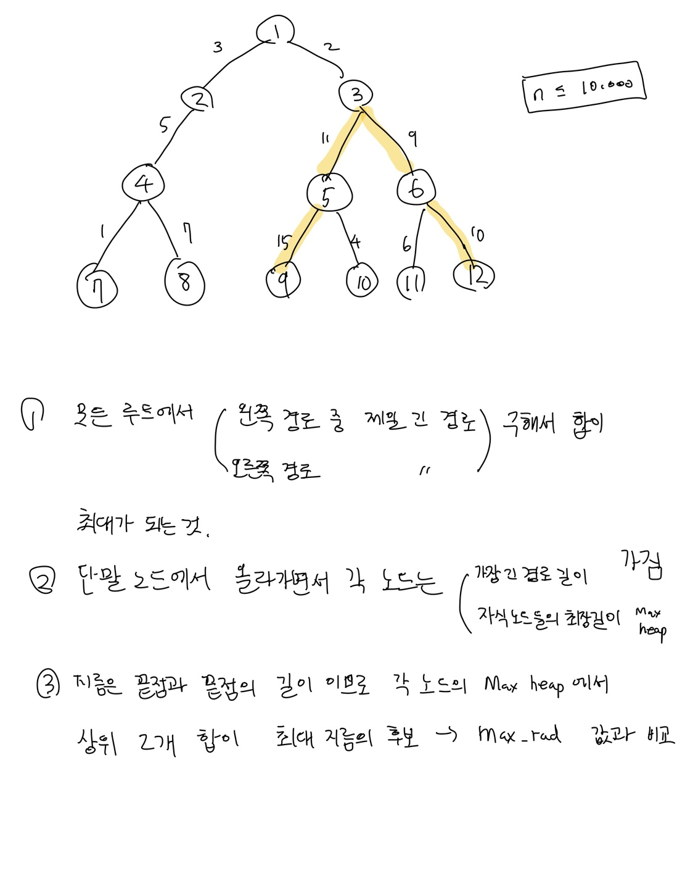

# 1967. 트리의 지름

**느낀점**
> 나는 트리 문제를 보면 단말 노드에서 접근하려고 하는데 이 문제는 그렇게 해서 풀렸지만 다른 문제들도 그렇게 풀릴 지 잘 모르겠다. 적당히 생각하는 시간을 들여 무난하게 풀었다.  

**풀이**
<ol type="I">
    
    <li>단말노드에서 부터 부모노드에 데이터 저장</li>
    <li>각 노드는 이진트리가 아니므로 자식노드들의 최장경로 길이를 저장하는 우선순위 큐를 가짐</li>
    <li>각 자식경로로부터 2개 이상의 최장 경로를 가지고 있는 노드들을 대상으로 최상위 2개 길이 합으로 최대 지름값을 갱신 시도 </li>
</ol>

**실수**
>1. 이진 트리라는 조건이 없는 걸 봤으면서 예제 그림만 믿고 이진 트리로 구성함.
>2. 우선순위 큐에서 max-heap을 만들 때 부호를 잘못줬음

